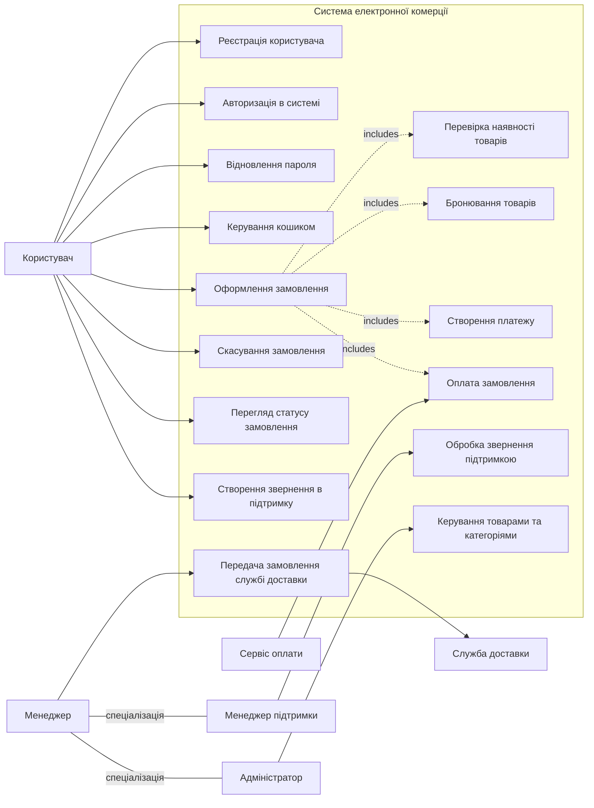

```mermaid
flowchart LR
    User[Користувач]
    Manager[Менеджер]
    SupportManager[Менеджер підтримки]
    Administrator[Адміністратор]
    Delivery[Служба доставки]
    Payment[Сервіс оплати]

    Manager ---|спеціалізація| SupportManager
    Manager ---|спеціалізація| Administrator

    subgraph System[Система електронної комерції]
        UC1[Реєстрація користувача]
        UC2[Авторизація в системі]
        UC3[Відновлення пароля]
        UC4[Керування кошиком]
        UC5[Оформлення замовлення]
        UC6[Перевірка наявності товарів]
        UC7[Бронювання товарів]
        UC8[Створення платежу]
        UC9[Оплата замовлення]
        UC10[Скасування замовлення]
        UC11[Перегляд статусу замовлення]
        UC12[Створення звернення в підтримку]
        UC13[Обробка звернення підтримкою]
        UC14[Керування товарами та категоріями]
        UC15[Передача замовлення службі доставки]
    end

    User --> UC1
    User --> UC2
    User --> UC3
    User --> UC4
    User --> UC5
    User --> UC10
    User --> UC11
    User --> UC12

    SupportManager --> UC13
    Administrator --> UC14
    Manager --> UC15

    UC5 -. includes .-> UC6
    UC5 -. includes .-> UC7
    UC5 -. includes .-> UC8
    UC5 -. includes .-> UC9

    UC15 --> Delivery
    Payment --> UC9
```
